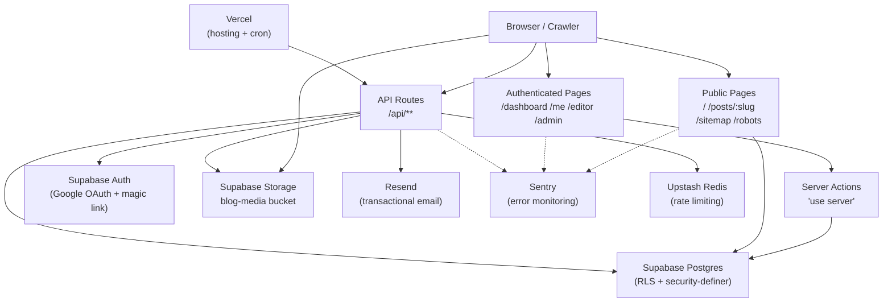
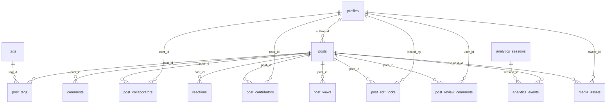
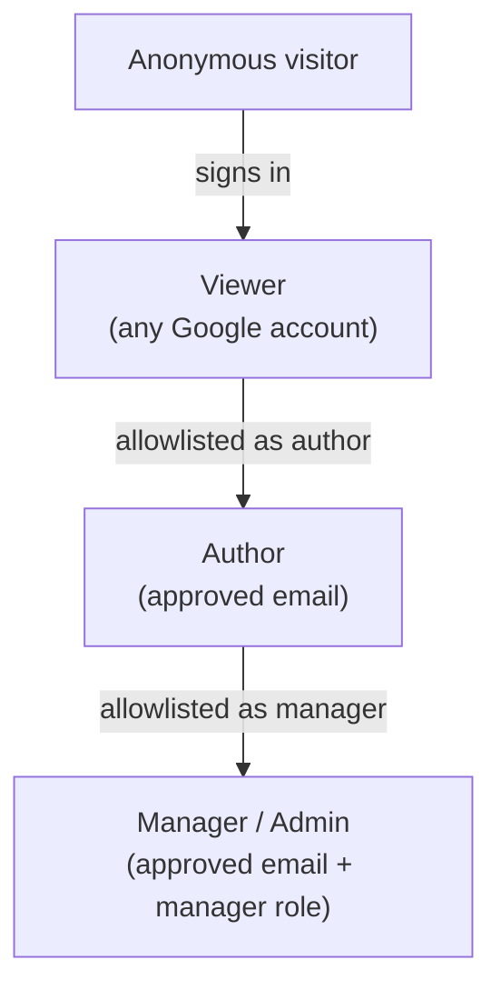
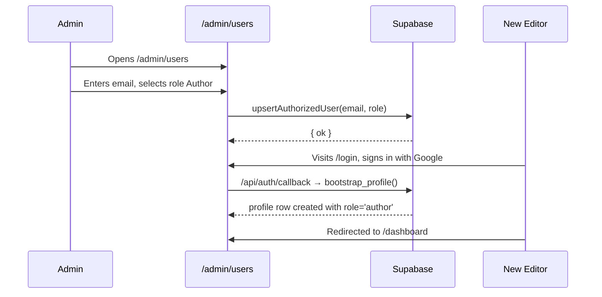
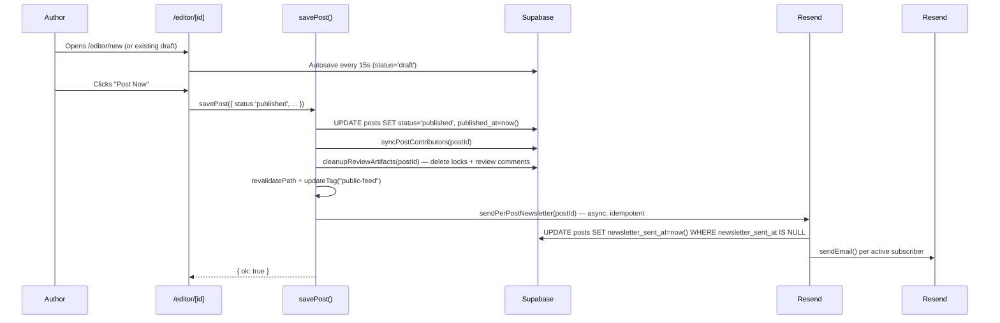
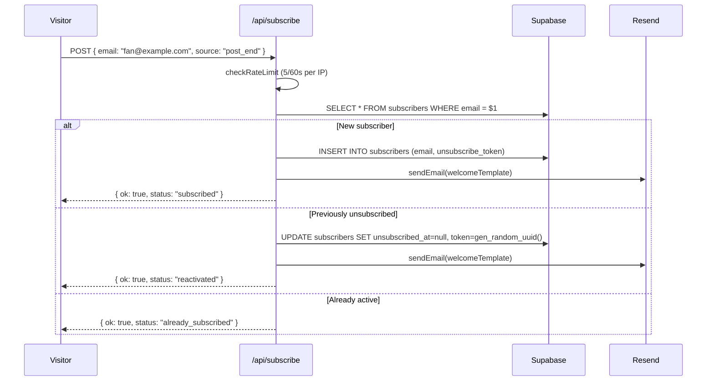

# CG SIGNAL — ConveGenius Team Blog Newsletter

> A retro-futuristic internal blog + newsletter for the ConveGenius.ai team.
> Public reading, private editing, Mon–Fri publishing cadence, real-time
> collaborative draft editing with edit-locking, per-post newsletter delivery,
> soft-deletes, comments, reactions, contributor bylines, OG-safe social
> previews, structured discovery metadata, rate-limited public writes, Sentry
> observability, light/dark theming, and a five-person editor allowlist —
> built on Next.js 16 + React 19 + Supabase + Resend.

**Production:** [convegenius-blog.vercel.app](https://convegenius-blog.vercel.app)

---

## Table of Contents

1. [Product Overview](#1-product-overview)
2. [Key Capabilities](#2-key-capabilities)
3. [Tech Stack](#3-tech-stack)
4. [Architecture Overview](#4-architecture-overview)
5. [File and Folder Structure](#5-file-and-folder-structure)
6. [Database Schema](#6-database-schema)
7. [Environment Variables](#7-environment-variables)
8. [Setup Instructions](#8-setup-instructions)
9. [Available Scripts / Commands](#9-available-scripts--commands)
10. [API Documentation](#10-api-documentation)
11. [User Roles and Permissions](#11-user-roles-and-permissions)
12. [Core User Flows](#12-core-user-flows)
13. [Feature Limitations and Known Gaps](#13-feature-limitations-and-known-gaps)
14. [Testing](#14-testing)
15. [Deployment](#15-deployment)
16. [Troubleshooting](#16-troubleshooting)
17. [Contribution Guidelines](#17-contribution-guidelines)
18. [Operations Playbook](#18-operations-playbook)
19. [Future Scope](#19-future-scope)
20. [Docs Index](#20-docs-index)

---

## 1. Product Overview

### Problem

The ConveGenius.ai team needs a lightweight place to publish daily work updates that's better than a Slack thread and lighter than a wiki — searchable, archived, on a rotating Mon–Fri schedule, visible to the whole team and any internal teammate who wants to read, capable of collaborative authoring, and able to push each new post directly to subscribers' inboxes without a separate newsletter tool.

### Solution

A public-read / private-write team blog with a five-person editor rotation, a built-in collaborative drafting system (invite-based editor/reviewer roles, one-person-at-a-time edit locking, draft review comments), and an integrated transactional newsletter. Everyone can read; only approved teammates can post. Anyone with a Google account can comment and react. Any visitor can subscribe to get future posts delivered the moment they publish.

### Audience

| Who | Access |
|---|---|
| 5 approved editors | Full write access; Aditya + Sumit as managers, Om + Insha + Aryan as authors |
| Internal `@convegenius.ai` readers | Full public read access without signing in |
| External readers (partners, public) | Full public read access without signing in |
| Any Google account | Comment, react, subscribe |
| Newsletter subscribers | Per-post email delivery; any email address |

### Non-goals

- Not a public CMS — the editor allowlist is hard-pinned to 5 emails.
- Not a growth-marketing site — editor/admin/API/auth surfaces are excluded from `robots.txt` and non-canonical Vercel preview hosts 308-redirect to production.
- Not a real-time presence platform — edit locking is optimistic with a 5-minute heartbeat, not Y.js/WebSocket-based.
- Not a discussion forum — comments are 100-character plain text, not threaded.

---

## 2. Key Capabilities

### Public Reading (no login required)

- **Landing page** (`/`) — hero, search box, channel/tag filter pills, fluid post grid, contributor crew section, subscribe block
- **Post detail** (`/posts/[slug]`) — sanitized rich-text body, multi-author byline with avatars, view count, read time, reaction bar, comment thread, mid-article + bottom subscribe CTAs, related posts, share button
- **Stable Open Graph previews** — `/api/og-image/[slug]` proxy re-signs the cover URL on every crawler hit so WhatsApp/LinkedIn/Slack/Twitter cards never break when Supabase signed URLs rotate
- **Dynamic sitemap + robots** — `/sitemap.xml` lists all published posts; `/robots.txt` allows reader pages while disallowing private surfaces; `BlogPosting` JSON-LD structured data on post pages
- **Search** — `?q=` matches title + excerpt in memory
- **Tag filter** — `?tag=<slug>` composes with search; both update the grid live
- **Live engagement counts** on cards — views (👁), reactions (❤️), comments (💬)
- **Co-author byline** — when a post has multiple contributors, `PostContributorsRow` shows each person's avatar, first name, and role (Owner / Editor / Contributor)

### Authentication

- **Google OAuth** (any Google account — Workspace, Gmail, ConveGenius)
- **Magic-link** email sign-in via Supabase Auth
- Login page at `/login`; auth callback bootstraps a `profiles` row on first sign-in
- **No domain block** for comment/react audience — gating happens at the editor tier

### Engagement (any signed-in user)

- **6-reaction bar** — Like / Love / Funny / Celebrate / Watching / Launch; multi-react allowed; optimistic UI
- **Plain-text comments** — 100-char body limit, soft-deletable with audit trail
- **Sign-in CTA** for anonymous visitors when they tap reaction/comment inputs

### Writing & Editing (5-person allowlist)

- **TipTap rich-text editor** with full formatting, heading levels, lists, code blocks, links, text color, horizontal rule
- **Smart paste** — strips Google Docs / Word / Notion vendor classes; bare YouTube/Vimeo/Loom URLs auto-become embedded nodes
- **Per-post tags, cover image picker, excerpt, and schedule picker**
- **Three-button publish flow** — Save Draft / Schedule Post / Post Now (or "Submit for Review" when manager-review mode is enabled)
- **Status lifecycle** — `draft → submitted (optional) → scheduled → published → archived`
- **Server autosave** every 15 seconds of inactivity + **localStorage backup** every 3 seconds (crash-resilient restore banner)
- **Word + read-time counters** (220 wpm baseline)
- **Sticky toolbar** — stays pinned while scrolling long drafts

### Collaborative Drafting

- **Invite collaborators** — post owner can invite approved team members as `editor` (can edit content) or `reviewer` (read-only with review comments)
- **One-person-at-a-time edit lock** — 5-minute TTL, 60-second heartbeat via `sendBeacon`/keepalive; the editor shows who holds the lock; owner/manager can force-release
- **Lock banners** — "Locked by [name]" banner with a Take Over button; "You are editing" / "Reviewer mode" status banners
- **Draft review comments** — reviewers (and collaborating editors) can leave ≤500-char thread comments; comments can be resolved/reopened; all review comments and locks are cleaned up on publish
- **"Shared with me" section** — collaborators see the posts they've been invited to in `/me/posts` under a dedicated Shared with Me panel with role badges
- **Contributor credit** — post contributors (owner + editors) are persisted to `post_contributors` and shown in the public co-author byline; credit is synced on every invite/remove/role-change and on publish; removed editors lose public credit

_Limitations: lock is advisory-only at the DB layer (enforced in the write path, not RLS); real-time presence is heartbeat-based, not WebSocket._

### Newsletter

- **Single opt-in** — subscribe form on landing page and on every post (bottom + mid-article on long posts)
- **Per-post newsletter delivery** — on publish, fans out a per-recipient email with thumbnail + title + excerpt + first paragraph
- **Idempotent send** — `newsletter_sent_at` guard prevents duplicate sends on retries
- **One-click unsubscribe** — RFC 8058-compliant `List-Unsubscribe` headers; token-based confirm/apply pages
- **Resend sandbox detection** — auto-detected; surfaced in `/api/admin/newsletter-diagnostics`
- **Rate-limited** — 5 subscribe attempts / 60s per IP when Upstash is configured

### Admin

- `/admin` — stats tiles (team size, published this week, awaiting review, all drafts), section nav
- `/admin/schedule` — Mon–Fri weekday assignment; conflict detection
- `/admin/users` — allowlist CRUD with self-lockout + last-admin guards
- `/admin/tags` — tag library with duplicate detection
- `/admin/analytics` — completion %, per-author metrics, top posts, engagement table, audience mix (logged-in vs anonymous), subscriber count
- `/admin/subscribers` — manager-gated signups table with search + status filter
- `/api/admin/newsletter-diagnostics` — Resend config debug endpoint

### Analytics

- **Per-post view tracking** — session-deduplicated (30-min window), captures device, browser, OS, geo, viewport, scroll depth, read complete flag
- **Event tracking** — `post_view`, `subscribe_cta_view`, `subscribe_submit`, `subscribe_success`, scroll-depth, react events
- **Per-author and per-post analytics** — completion rates, engagement tables in `/admin/analytics`
- **Vercel Analytics + Speed Insights** — web vitals and page-view telemetry

### Design System

- **Retro-futuristic editorial OS** aesthetic — monospace UI text, strong outlines, sparing accent colors
- **Pre-hydration theme script** — no flash of wrong colors; light default for first-time visitors
- **Light / dark toggle** — explicit user preference persisted in localStorage; instant CSS-variable swap without React re-render
- **Responsive grid** — auto-fit columns, `clamp` fluid gaps, `min-w-0` on all flex children; mobile-first throughout

---

## 3. Tech Stack

| Layer | Choice | Notes |
|---|---|---|
| Framework | **Next.js 16 (App Router)** | Server components, server actions, ISR, dynamic params as `Promise` |
| UI runtime | **React 19** | Client components only for interactive surfaces |
| Language | **TypeScript 5 (strict)** | `noUncheckedIndexedAccess`, no `any` allowed |
| Database | **Supabase Postgres** | RLS native, free tier, easy migrations, security-definer helpers |
| Auth | **Supabase Auth** | Google OAuth + magic-link; SSR cookie handling via `@supabase/ssr` |
| Storage | **Supabase Storage** | Private `blog-media` bucket; direct browser uploads; per-request re-signing |
| Editor | **TipTap v2** | JSON-first, extensible; custom `AudioBlock`, `VideoBlock`, `EmbedBlock` nodes |
| Styling | **Tailwind CSS 3 + CSS variables** | Atomic + design-system tokens; `data-theme` dark/light |
| Fonts | **next/font** | Orbitron (hero), Space Mono (UI); self-hosted, no FOUT |
| Validation | **Zod** | Single schema for both action input and runtime checks |
| Notifications | **Sonner** | Lightweight accessible toasts |
| Icons | **lucide-react** | Tree-shakeable |
| Transactional email | **Resend** | REST API, RFC 8058 headers, sandbox/verified-domain modes |
| Hosting | **Vercel** | Auto-deploy from `main`; cron jobs; edge runtime |
| Product analytics | **Vercel Analytics + Speed Insights** | SSR-safe, no tracking pixels |
| Error monitoring | **Sentry for Next.js v10** | Browser/server/edge capture; `/monitoring` tunnel for ad-blockers |
| Rate limiting | **Upstash Redis** | Sliding-window limiter; graceful no-op when env vars missing |
| Testing (unit) | **Vitest + jsdom** | 9 test files, 48 assertions |
| Testing (e2e) | **Playwright** | Against deployed/staging instance |
| Form handling | **react-hook-form + @hookform/resolvers** | Used in admin panels |

No SWR / React Query — server components + ISR + `unstable_cache` + tag invalidation covers the SWR pattern at the server boundary. See `docs/frontend-cache-audit.md` for the full rationale.

---

## 4. Architecture Overview

### High-level



### Render model

- **Server Components** by default — every page resolves data on the server before the response is sent
- **Client Components** (`"use client"`) — only for interactive surfaces: reactions, comments, subscribe form, theme toggle, editor, post-view tracker, lock heartbeat
- **Server Actions** (`"use server"`) — every mutation; Zod-validated inputs, ownership checks, `revalidatePath` + `updateTag` invalidation, structured `{ ok, error? }` returns
- **ISR** — landing page at 60-second TTL via `revalidate = 60`; public reads wrapped in `unstable_cache` tagged `public-feed`; `force-dynamic` for per-user pages

### Request flows

**Public post read:**
Browser → Next server → `lib/db/public.ts` (service-role client, `status='published'`) → attach cover URLs, view counts, engagement counts, contributors → render

**Editor save:**
Browser → `app/(app)/editor/actions.ts:savePost()` → Zod validate → `requireSession/Author` → check edit lock → check collaborator role → Supabase write → `revalidatePath` + `updateTag` → `{ ok }`

**Edit lock acquire:**
`PostEditor` mount → `POST /api/posts/[id]/lock` → `getLockActor()` → upsert lock row → return `{ ok, lockedBy, expiresAt }` or 409 with current holder

### Caching topology

| Surface | Strategy | TTL | Invalidated by |
|---|---|---|---|
| Landing post grid / tags / contributor stats | `unstable_cache` tagged `public-feed` | 60 s | `updateTag("public-feed")` from server actions; `revalidateTag` from cron |
| Post detail page | `force-dynamic` | none | `revalidatePath("/posts/${slug}")` on publish / comment / reaction |
| Admin / dashboard / my-posts | `force-dynamic` | none | direct `revalidatePath` on writes |
| OG image proxy | `Cache-Control: public, max-age=3600, s-maxage=3600` | 1 h | n/a |
| Media file proxy | `Cache-Control: public, max-age=3000, s-maxage=3000` | 50 min | n/a |

### Cron jobs (`vercel.json`)

| Schedule | Route | Purpose |
|---|---|---|
| `0 9 * * *` | `/api/cron/publish-scheduled` | Promote due scheduled posts to published; send newsletters; revalidate `public-feed` |
| `0 6 * * *` | `/api/cron/keep-alive` | Supabase free-tier warm-up read |

---

## 5. File and Folder Structure

```
CG-Signal/
├── app/                              # Next.js App Router root
│   ├── (app)/                        # Authenticated group — requires session
│   │   ├── actions/                  # Shared server actions (viewMode toggle)
│   │   ├── admin/                    # Manager-only pages (stats, schedule, users, tags, analytics, subscribers)
│   │   │   ├── actions.ts            # Admin server actions (setWeekday, upsertAuthorizedUser, createTag, …)
│   │   │   ├── analytics/            # Analytics dashboard + per-user detail
│   │   │   ├── schedule/
│   │   │   ├── subscribers/
│   │   │   ├── tags/
│   │   │   └── users/
│   │   ├── blog/                     # Legacy /blog → / redirect
│   │   ├── dashboard/                # Editor command-center
│   │   ├── editor/
│   │   │   ├── [id]/page.tsx         # Edit an existing post (loads collaboration props)
│   │   │   ├── actions.ts            # savePost, createDraftFromTemplate, soft/hard delete, collaboration actions
│   │   │   └── new/page.tsx          # Create a new post
│   │   ├── me/
│   │   │   └── posts/page.tsx        # My Posts + Shared with Me + Trash
│   │   └── layout.tsx                # Auth required; renders TopNav + PortalFooter
│   ├── (auth)/                       # Public auth group
│   │   ├── login/                    # Sign-in page
│   │   └── unauthorized/             # Access-denied page
│   ├── api/                          # API route handlers
│   │   ├── admin/newsletter-diagnostics/   # Manager-only Resend debug
│   │   ├── analytics/
│   │   │   ├── event/route.ts        # Generic event tracking
│   │   │   └── post-view/route.ts    # Per-post view registration
│   │   ├── auth/
│   │   │   ├── callback/route.ts     # OAuth / magic-link return; bootstraps profile
│   │   │   └── signout/route.ts      # Clears session cookie
│   │   ├── cron/
│   │   │   ├── keep-alive/route.ts   # Daily Supabase warm-up
│   │   │   └── publish-scheduled/route.ts  # Daily post promotion + newsletter
│   │   ├── media/
│   │   │   ├── file/route.ts         # Per-request media re-sign (302 + cache)
│   │   │   ├── list/route.ts         # Media picker source
│   │   │   ├── signed-url/route.ts   # Admin tooling
│   │   │   └── upload/route.ts       # Metadata registration after direct upload
│   │   ├── og-image/[slug]/route.ts  # Stable OG image proxy
│   │   ├── posts/[id]/lock/
│   │   │   ├── route.ts              # Acquire edit lock
│   │   │   ├── heartbeat/route.ts    # Refresh lock TTL
│   │   │   └── unlock/route.ts       # Release lock
│   │   └── subscribe/
│   │       ├── route.ts              # Newsletter subscribe
│   │       └── unsubscribe/route.ts  # One-click unsubscribe
│   ├── archive/                      # Legacy /archive → /me/posts#trash
│   ├── my-posts/                     # Legacy /my-posts → /me/posts
│   ├── posts/
│   │   └── [slug]/
│   │       ├── page.tsx              # Public post detail
│   │       └── actions.ts            # addComment, deleteComment, toggleReaction
│   ├── transmit/                     # Legacy /transmit → /editor/new
│   ├── globals.css                   # CSS variables (colors, radii, shadows, typography)
│   ├── layout.tsx                    # Root layout: fonts, ThemeProvider, Toaster, Analytics
│   ├── page.tsx                      # Landing page
│   ├── robots.ts                     # SEO exclusion rules
│   └── sitemap.ts                    # Dynamic XML sitemap
│
├── components/                       # React components
│   ├── admin/                        # ScheduleEditor, TagsAdmin, UsersAdmin
│   ├── analytics/                    # AnalyticsTracker, PostViewTracker, PostAnalyticsTracker, DemoWatchingCounter
│   ├── auth/                         # LoginForm
│   ├── blog/                         # PostCard, PostRowActions
│   ├── comments/                     # CommentsSection, CommentItem, CommentForm
│   ├── dashboard/                    # WeeklyScheduleCard
│   ├── editor/
│   │   ├── PostEditor.tsx            # Main editor: TipTap instance, lock lifecycle, autosave, banners
│   │   ├── PostEditorLoader.tsx      # Lazy-loads editor chunk
│   │   ├── EditorToolbar.tsx         # Sticky formatting toolbar
│   │   ├── SchedulePostModal.tsx     # Calendar + time picker
│   │   ├── CollaboratorsPanel.tsx    # Invite/remove collaborators, role management
│   │   └── ReviewCommentsPanel.tsx   # Draft review comments thread
│   ├── landing/                      # ContributorCard, ContributorsSection, PostThumbnail, SubscribeSection, SubscribeMiniCta
│   ├── layout/                       # PublicNav, TopNav, PortalFooter, ViewModeBanner, ViewModeButton
│   ├── posts/
│   │   ├── PostContributorsRow.tsx   # Co-author byline (avatar + first name + role per contributor)
│   │   └── PostShareButton.tsx       # Web Share API + clipboard fallback
│   ├── portal/                       # BrandLockup, Panel, SystemLabel, Ticker
│   ├── reactions/                    # ReactionsBar
│   ├── theme/                        # ThemeProvider, ThemeScript, ThemeToggle
│   └── ui/                           # Button, Card, Input, Textarea, Avatar, Badge, Select, Skeleton
│
├── lib/                              # Server utilities and business logic
│   ├── analytics/                    # client-context.ts, server.ts, track.ts, events.ts, admin.ts
│   ├── api/
│   │   └── edit-lock.ts              # getLockActor() — shared by all three lock routes
│   ├── auth/
│   │   ├── collaboration.ts          # Pure permission logic: deriveAccess(), isLockActive(), PostAccess interface
│   │   ├── guards.ts                 # requireSession(), requireAuthor(), requireManager()
│   │   ├── roles.ts                  # roleLabel(), role comparison helpers
│   │   ├── safeRedirect.ts           # Prevents open-redirect attacks
│   │   └── viewMode.ts               # "View as member" cookie logic
│   ├── db/
│   │   ├── collaboration.ts          # getCollaboratorRole(), resolvePostAccess(), listCollaborators(), loadEditorCollaboration()
│   │   ├── posts.ts                  # getDraftPostByIdWithAccess(), listSharedPosts(), listEditablePostsForUser()
│   │   ├── profiles.ts               # getProfile(), listProfiles(), updateProfile()
│   │   ├── public.ts                 # listPublicPosts(), getPublicPostBySlug(), attachContributors(), PUBLIC_FEED_TAG
│   │   ├── tags.ts                   # listTags(), createTag(), deleteTag()
│   │   └── types.ts                  # Hand-written DB types: enums, row interfaces, Database map
│   ├── editor/                       # sanitize.ts, extensions.ts, media-extensions.ts, paste-sanitize.ts, template.ts
│   ├── email/                        # resend.ts, templates.ts, newsletter.ts
│   ├── media/
│   │   └── direct-upload.ts          # Browser → Supabase Storage direct upload helper
│   ├── seo/                          # get-og-image-url.ts
│   ├── supabase/                     # client.ts, server.ts, middleware.ts
│   ├── utils/                        # cn.ts, dates.ts, embeds.ts, file-validation.ts, names.ts, normalize-text.ts, read-time.ts, slugs.ts
│   ├── brand.ts                      # Brand identity constants
│   ├── env.ts                        # Centralized env access; splits public/server-only vars
│   ├── ratelimit.ts                  # Upstash sliding-window limiter
│   ├── reactions.ts                  # ALLOWED_REACTIONS, EmojiLabel enum
│   ├── team.ts                       # TEAM_META.displayOrder (stable contributor order)
│   └── theme/                        # theme-config.ts
│
├── supabase/
│   ├── migrations/                   # SQL migrations 0001–0014 (run in order)
│   └── config.toml                   # Supabase CLI project config
│
├── tests/
│   ├── e2e/                          # Playwright tests (auth.spec.ts, post-contributors.spec.ts)
│   └── unit/                         # Vitest tests (9 files, 48 assertions)
│
├── docs/                             # Living documentation (see § 20)
├── public/                           # Static assets (cg.png, og-default.png)
├── .env                              # Local environment variables (never commit real secrets)
├── instrumentation.ts                # Boot-time env validation + Sentry init
├── middleware.ts                     # Edge middleware: cookie refresh + canonical host redirect
├── next.config.mjs                   # Next.js + Sentry config
├── playwright.config.ts
├── tailwind.config.ts
├── tsconfig.json
├── vercel.json                       # Cron job declarations
└── vitest.config.ts
```

---

## 6. Database Schema

Migrations are in `supabase/migrations/` and must be applied in order. The Supabase CLI (`supabase db push`) or the SQL editor can be used.

| Migration | Purpose |
|---|---|
| `0001_init.sql` | Enums, core tables (app_settings, profiles, authorized_users, tags, post_templates, posts, media_assets, post_tags, audit_logs), triggers, indexes |
| `0002_helpers_and_bootstrap.sql` | Security-definer RPC helpers (is_convegenius_user, current_user_role, is_manager, bootstrap_profile, assign_weekday) |
| `0003_rls_policies.sql` | RLS policies on every table + storage policies on `blog-media` |
| `0004_constraints_and_indexes.sql` | Performance indexes (posts by author/status, post_tags by tag_id) |
| `0005_rewrite_signed_media_urls.sql` | One-shot rewrite of legacy signed URLs to `/api/media/file?path=…` |
| `0007_comments_reactions.sql` | `comments` + `reactions` tables + RLS |
| `0008_subscribers.sql` | `subscribers` table with `unsubscribe_token`, `unsubscribed_at`, `source` |
| `0009_newsletter_sent_at.sql` | `posts.newsletter_sent_at` + partial index for unsent published posts |
| `0010_post_views.sql` | `post_views` table for per-session view analytics |
| `0011_save_performance_indexes.sql` | Indexes for the save/publish hot path |
| `0012_analytics_v2.sql` | `analytics_sessions` + `analytics_events` tables for rich event tracking |
| `0013_collaboration.sql` | `post_collaborators`, `post_edit_locks`, `post_review_comments`, `post_contributors` + 7 security-definer collaboration helpers + `tg_posts_protect_author` trigger |
| `0014_sync_contributors.sql` | Backfill owner + editor credit rows into `post_contributors` for existing published posts |

### Enums

| Enum | Values |
|---|---|
| `app_role` | `viewer`, `author`, `manager` |
| `post_status` | `draft`, `submitted`, `scheduled`, `published`, `archived` |
| `media_type` | `image`, `video`, `audio`, `document` |
| `media_source_type` | `upload`, `external_url` |
| `post_collaborator_role` | `editor`, `reviewer` |
| `post_contributor_role` | `owner`, `editor`, `contributor` |

### Tables

#### Core

```sql
app_settings (
  id        int  PK  CHECK (id = 1),      -- singleton row
  allowed_domain         text,
  require_manager_review bool,
  max_upload_mb          int,
  updated_at             timestamptz
)

profiles (
  id              uuid PK → auth.users,
  email           text UNIQUE,
  full_name       text,
  avatar_url      text,
  role            app_role DEFAULT 'viewer',
  weekly_post_day smallint CHECK (1–5),
  is_active       bool DEFAULT true,
  created_at      timestamptz,
  updated_at      timestamptz      -- auto via tg_set_updated_at trigger
)
INDEX: (email), (role)

authorized_users (
  id              uuid PK,
  email           text UNIQUE,
  role            app_role,
  weekly_post_day smallint,
  created_by      uuid → profiles,
  created_at      timestamptz
)

posts (
  id               uuid PK,
  author_id        uuid → profiles,
  title            text,
  slug             text UNIQUE,
  excerpt          text,
  content_json     jsonb,
  content_html     text,
  status           post_status DEFAULT 'draft',
  week_start_date  date,
  assigned_weekday smallint,
  published_at     timestamptz,
  scheduled_for    timestamptz,
  cover_media_id   uuid → media_assets,
  read_time_minutes int DEFAULT 0,
  newsletter_sent_at timestamptz,
  created_at       timestamptz,
  updated_at       timestamptz,    -- auto via tg_set_updated_at trigger
  archived_at      timestamptz
)
INDEX: (status, published_at DESC), (author_id, week_start_date), (slug)
TRIGGER: tg_posts_protect_author — non-managers cannot change author_id (prevents ownership hijack)

tags (
  id         uuid PK,
  name       text UNIQUE,
  slug       text UNIQUE,
  created_at timestamptz
)

post_tags (
  post_id  uuid → posts,
  tag_id   uuid → tags,
  PRIMARY KEY (post_id, tag_id),
  ON DELETE CASCADE
)

post_templates (
  id           uuid PK,
  name         text,
  description  text,
  content_json jsonb,
  is_default   bool,
  created_by   uuid → profiles,
  created_at   timestamptz
)

media_assets (
  id               uuid PK,
  owner_id         uuid → profiles,
  post_id          uuid → posts (ON DELETE SET NULL),
  storage_bucket   text,
  storage_path     text,
  source_type      media_source_type,
  media_type       media_type,
  mime_type        text,
  size_bytes       bigint,
  external_url     text,
  provider         text,
  title            text,
  alt_text         text,
  duration_seconds int,
  created_at       timestamptz
)
INDEX: (post_id), (owner_id)

audit_logs (
  id          uuid PK,
  actor_id    uuid → profiles,
  action      text,
  entity_type text,
  entity_id   uuid,
  metadata    jsonb,
  created_at  timestamptz
)
INDEX: (actor_id)
```

#### Engagement

```sql
comments (
  id               uuid PK,
  post_id          uuid → posts,
  user_id          uuid → auth.users,
  author_name      text,
  author_avatar_url text,
  body             text CHECK (LENGTH(body) BETWEEN 1 AND 100),
  created_at       timestamptz,
  deleted_at       timestamptz,    -- soft delete
  deleted_by       uuid → auth.users
)
INDEX: (post_id, created_at DESC), (user_id)

reactions (
  id         uuid PK,
  post_id    uuid → posts,
  user_id    uuid → auth.users,
  emoji      text CHECK (emoji IN ('👍','❤️','😂','🎉','👀','🚀')),
  created_at timestamptz,
  UNIQUE (post_id, user_id, emoji)
)

subscribers (
  id                uuid PK,
  email             text UNIQUE,
  unsubscribe_token uuid DEFAULT gen_random_uuid(),
  unsubscribed_at   timestamptz,
  created_at        timestamptz,
  source            text
)
INDEX: (unsubscribed_at), (unsubscribe_token)
```

#### Analytics

```sql
post_views (
  id                  uuid PK,
  post_id             uuid → posts,
  viewer_id           uuid → auth.users (nullable),
  session_id          text,
  user_agent          text,
  referrer            text,
  ip_hash             text,
  created_at          timestamptz,
  path                text,
  device_type         text,
  browser             text,
  os                  text,
  country             text,
  city                text,
  viewport_width      int,
  viewport_height     int,
  time_zone           text,
  language            text,
  is_logged_in        bool,
  time_spent_seconds  int,
  scroll_depth        int,
  read_complete       bool
)
INDEX: (post_id), (created_at), (post_id, session_id, created_at) for dedupe

analytics_sessions (
  id              uuid PK,
  session_id      text UNIQUE,
  user_id         uuid → auth.users (nullable),
  first_seen_at   timestamptz,
  last_seen_at    timestamptz,
  device_type     text,
  browser         text,
  os              text,
  country         text,
  city            text,
  referrer        text,
  landing_path    text,
  user_agent      text,
  ip_hash         text,
  event_count     int DEFAULT 0,
  page_view_count int DEFAULT 0
)
INDEX: (user_id), (last_seen_at), (device_type)

analytics_events (
  id         uuid PK,
  session_id text → analytics_sessions.session_id,
  user_id    uuid → auth.users (nullable),
  event_name text CHECK (event_name IN ('page_view','post_view','subscribe_cta_view',
                         'subscribe_submit','subscribe_success','post_share',
                         'post_react','post_comment','scroll_depth',...)),
  post_id    uuid → posts (nullable),
  path       text,
  metadata   jsonb,
  created_at timestamptz
)
INDEX: (post_id, created_at), (session_id, created_at), (user_id, created_at), (event_name, created_at)
```

#### Collaboration

```sql
post_collaborators (
  id          uuid PK,
  post_id     uuid → posts,
  user_id     uuid → profiles,
  role        post_collaborator_role,  -- 'editor' | 'reviewer'
  invited_by  uuid → profiles,
  created_at  timestamptz,
  UNIQUE (post_id, user_id)
)
INDEX: (post_id), (user_id)

post_edit_locks (
  post_id    uuid PK → posts,
  locked_by  uuid → profiles,
  locked_at  timestamptz,
  expires_at timestamptz      -- TTL = 5 minutes; refreshed by 60s heartbeat
)
INDEX: (expires_at)

post_review_comments (
  id          uuid PK,
  post_id     uuid → posts,
  user_id     uuid → profiles,
  body        text CHECK (LENGTH(body) <= 500),
  resolved_at timestamptz,    -- nullable; set when resolved
  created_at  timestamptz
)
INDEX: (post_id, created_at DESC)

post_contributors (
  id            uuid PK,
  post_id       uuid → posts,
  user_id       uuid → profiles,
  role          post_contributor_role,  -- 'owner' | 'editor' | 'contributor'
  display_order int DEFAULT 50,         -- owner = 0
  created_at    timestamptz,
  UNIQUE (post_id, user_id)
)
INDEX: (post_id, display_order)
```

### Security Model

RLS is enabled on all tables. Policies are built on **security-definer helper functions** to prevent recursion:

```
Auth helpers (bypass RLS):
  current_user_email()          → authenticated user's email
  is_convegenius_user()         → email domain matches APP_ALLOWED_EMAIL_DOMAIN
  current_user_role()           → 'viewer' | 'author' | 'manager'
  is_manager()                  → role = 'manager'
  is_author_or_manager()        → role ∈ {'author','manager'}
  is_authorized_author()        → role ∈ {'author','manager'}

Collaboration helpers (called by post_collaborators, post_edit_locks, etc. — NOT by posts
itself, to avoid recursion where a posts policy reads post_collaborators whose policy reads posts):
  is_post_owner(post_id)                → author_id = current user
  is_post_collaborator(post_id)         → row exists in post_collaborators
  is_post_editor_collaborator(post_id)  → collaborator with role='editor'
  can_read_draft_post(post_id)          → owner OR collaborator (either role)
  can_edit_draft_post(post_id)          → owner OR editor collaborator
  can_review_draft_post(post_id)        → owner OR any collaborator
  can_manage_post_collaborators(post_id) → owner OR manager
```

### Entity Relationship



---

## 7. Environment Variables

### Required

| Variable | Scope | Purpose | Example |
|---|---|---|---|
| `NEXT_PUBLIC_APP_URL` | public | Canonical app origin; used in email links + OG URLs | `https://convegenius-blog.vercel.app` |
| `NEXT_PUBLIC_SUPABASE_URL` | public | Supabase project URL | `https://xyzxyz.supabase.co` |
| `NEXT_PUBLIC_SUPABASE_PUBLISHABLE_KEY` | public | Supabase anon/publishable key | `eyJhbGci...` |
| `SUPABASE_SERVICE_ROLE_KEY` | **server only** | Service-role key for bypassing RLS on server reads/writes | `eyJhbGci...` |
| `APP_ALLOWED_EMAIL_DOMAIN` | both | Internal domain; controls who is recognized as an internal user | `convegenius.ai` |
| `APP_MANAGER_EMAIL` | both | Comma-separated manager emails; seeded into `authorized_users` | `aditya.c@convegenius.ai,sumit.kumar@convegenius.ai` |
| `APP_AUTHOR_EMAILS` | both | Comma-separated author emails; seeded into `authorized_users` | `om.kumar@convegenius.ai,...` |
| `CRON_SECRET` | server | Bearer token authenticating cron route calls; minimum 24 chars in production | `openssl rand -hex 32` output |
| `RESEND_API_KEY` | server | Resend transactional email API key | `re_...` |
| `RESEND_FROM` | server | Sender address; `onboarding@resend.dev` (sandbox) or `newsletter@<domain>` (verified) | `newsletter@convegenius.ai` |

### Optional

| Variable | Default | Purpose |
|---|---|---|
| `NEXT_PUBLIC_REQUIRE_MANAGER_REVIEW` | `false` | If `true`, author "Post Now" becomes "Submit for Review" (`status = submitted`) |
| `NEXT_PUBLIC_MAX_UPLOAD_MB` | `50` | Per-file image upload cap |
| `NEXT_PUBLIC_MAX_VIDEO_UPLOAD_MB` | `50` | Per-file video upload cap |
| `NEXT_PUBLIC_MAX_AUDIO_UPLOAD_MB` | `50` | Per-file audio upload cap |
| `NEXT_PUBLIC_ENABLE_DEMO_WATCHING_COUNTER` | `false` | Show the explicitly-labeled simulated activity pill in the public nav |
| `NEXT_PUBLIC_SENTRY_DSN` | unset | Browser Sentry capture; production boot warns when missing |
| `SENTRY_DSN` | unset | Server/edge Sentry capture; falls back to public DSN |
| `SENTRY_ORG` | unset | Sentry org slug for source-map upload during Vercel builds |
| `SENTRY_PROJECT` | unset | Sentry project slug |
| `SENTRY_AUTH_TOKEN` | unset | Sentry source-map upload token |
| `UPSTASH_REDIS_REST_URL` | unset | Enables rate limiting when paired with token |
| `UPSTASH_REDIS_REST_TOKEN` | unset | Enables rate limiting when paired with URL |
| `AUTH_TEST_BASE_URL` | `http://localhost:3000` | Base URL for Playwright e2e tests |
| `CONTRIBUTORS_TEST_SLUG` | unset | Published post slug for co-author byline e2e test |
| `CONTRIBUTORS_TEST_NAMES` | unset | Comma-separated expected contributor first names for e2e test |

> **Security note:** `SUPABASE_SERVICE_ROLE_KEY` must never reach the browser bundle. It is only imported inside `lib/supabase/server.ts → createSupabaseServiceClient()`. Rate limiting and Sentry degrade gracefully when their env vars are missing; `instrumentation.ts` warns in production if they are absent.

---

## 8. Setup Instructions

### Prerequisites

- **Node.js ≥ 20** and **npm ≥ 10**
- A **Supabase** project (free tier sufficient)
- A **Google Cloud** OAuth 2.0 client (for Google sign-in)
- (Optional) **Resend** account for newsletter delivery
- (Optional) **Upstash Redis** for rate limiting

### 1. Clone and install

```powershell
git clone <repo-url> CG-Signal
cd CG-Signal
npm install
```

### 2. Configure environment variables

```powershell
Copy-Item .env .env.local
# Edit .env.local and fill in all required variables from § 7
```

### 3. Set up Supabase

1. Create a new Supabase project at [supabase.com](https://supabase.com)
2. Copy the **Project URL**, **anon key**, and **service-role key** into `.env.local`
3. Open the SQL Editor and apply migrations in order:

```sql
-- Run each file in order via Supabase SQL Editor or supabase db push
supabase/migrations/0001_init.sql
supabase/migrations/0002_helpers_and_bootstrap.sql
supabase/migrations/0003_rls_policies.sql
supabase/migrations/0004_constraints_and_indexes.sql
supabase/migrations/0005_rewrite_signed_media_urls.sql
-- 0006 is intentionally absent (skipped migration slot)
supabase/migrations/0007_comments_reactions.sql
supabase/migrations/0008_subscribers.sql
supabase/migrations/0009_newsletter_sent_at.sql
supabase/migrations/0010_post_views.sql
supabase/migrations/0011_save_performance_indexes.sql
supabase/migrations/0012_analytics_v2.sql
supabase/migrations/0013_collaboration.sql
supabase/migrations/0014_sync_contributors.sql
```

4. In **Storage**, create a private bucket named `blog-media`
5. In **Auth → URL Configuration**:
   - Site URL: `http://localhost:3000`
   - Redirect URLs: `http://localhost:3000/api/auth/callback`, `<your-production-url>/api/auth/callback`
6. In **Auth → Providers → Google**: paste OAuth client ID + secret from Google Cloud Console
7. In **Auth → Providers → Email**: enable Magic Link, disable "Confirm email"

### 4. Run locally

```powershell
npm run dev     # http://localhost:3000
```

Sign in with your `@convegenius.ai` Google account. The `authorized_users` table (seeded from `APP_AUTHOR_EMAILS` / `APP_MANAGER_EMAIL` on first server action) controls who gets author/manager roles.

### 5. Set up Resend (optional but recommended)

1. Create a [Resend](https://resend.com) account
2. Verify your domain or use sandbox (`onboarding@resend.dev`)
3. Create an API key with **Send** permission
4. Add `RESEND_API_KEY` + `RESEND_FROM` to `.env.local`
5. After signing in as a manager, visit `/api/admin/newsletter-diagnostics` to confirm configuration

### 6. Set up Upstash (optional)

1. Create an [Upstash](https://upstash.com) Redis database
2. Copy REST URL + token into `.env.local`

---

## 9. Available Scripts / Commands

| Command | What it does |
|---|---|
| `npm run dev` | Start Next.js development server at `http://localhost:3000` |
| `npm run build` | Production build; catches TypeScript and Next compile errors |
| `npm start` | Start production server (after `build`) |
| `npm run typecheck` | Run `tsc --noEmit` — type-check the entire codebase without emitting files |
| `npm run lint` | Run ESLint via `next lint` — **note: `next lint` was removed in Next 16; run `npx eslint .` directly** |
| `npm test` | Run Vitest unit suite once |
| `npm run test:watch` | Run Vitest in watch mode |
| `npm run e2e` | Run Playwright e2e tests (requires `AUTH_TEST_BASE_URL` pointing at a running instance) |

### Direct commands (useful in development)

```powershell
# Type-check only
npx tsc --noEmit

# Lint changed files only
npx eslint src/... components/... lib/...

# Run a specific unit test file
npx vitest run tests/unit/collaboration.test.ts

# Run a specific e2e test
npx playwright test post-contributors

# Trigger the scheduled publish cron locally
curl -H "Authorization: Bearer $env:CRON_SECRET" http://localhost:3000/api/cron/publish-scheduled
```

---

## 10. API Documentation

All routes validate inputs with Zod. All authenticated routes check session via Supabase SSR cookies. Service-role operations are server-only.

### Auth

| Method | Path | Auth | Request | Response |
|---|---|---|---|---|
| `GET` | `/api/auth/callback?code=&redirect=` | None | `code` (OAuth code), `redirect` (safe path) | 302 to dashboard or `/`; sets session cookie; bootstraps `profiles` row |
| `POST` | `/api/auth/signout` | Session | none | 302 to `/login`; clears session cookie |

### Media

| Method | Path | Auth | Request | Response |
|---|---|---|---|---|
| `POST` | `/api/media/upload` | Author+ | `{ path, fileName, mimeType, sizeBytes, postId? }` | `{ ok, path, signedUrl, mediaType, mediaId }` |
| `GET` | `/api/media/file?path=<encoded>` | None (published) | path query param | 302 + 50-min cache to signed Supabase URL; 404 if draft/not found |
| `GET` | `/api/media/signed-url?path=<path>` | Author+ | path query param | `{ ok, signedUrl }` |
| `GET` | `/api/media/list?postId=<uuid>` | Author+ | postId query | `{ ok, assets: MediaAssetRow[] }` |

**Media upload error codes:** `400` bad MIME/size, `403` wrong owner or reviewer, `429` rate limit exceeded

### Newsletter

| Method | Path | Auth | Request | Response |
|---|---|---|---|---|
| `POST` | `/api/subscribe` | None | `{ email, source? }` | `{ ok: true, status: "subscribed"\|"already_subscribed"\|"reactivated" }` |
| `GET` | `/api/subscribe/unsubscribe?t=<token>` | None | `t` query | HTML confirm page |
| `POST` | `/api/subscribe/unsubscribe?t=<token>` | None | `t` query | HTML success page |

### Analytics

| Method | Path | Auth | Request | Response |
|---|---|---|---|---|
| `POST` | `/api/analytics/post-view` | Session optional | `{ postId, slug?, sessionId, referrer, path, viewportWidth, viewportHeight, isLoggedIn, timeSpentSeconds?, scrollDepth?, readComplete? }` | `{ ok }` |
| `POST` | `/api/analytics/event` | Session optional | `{ sessionId, eventName, postId?, metadata }` | `{ ok }` |

**Allowed event names:** `page_view`, `post_view`, `subscribe_cta_view`, `subscribe_submit`, `subscribe_success`, `post_share`, `post_react`, `post_comment`, `scroll_depth`

### Edit Locks (Collaboration)

| Method | Path | Auth | Request | Response |
|---|---|---|---|---|
| `POST` | `/api/posts/[id]/lock` | Author+ | none | `{ ok, lockedBy: { id, name, avatarUrl }, expiresAt }` on success; `409` with `{ holder: { id, name, avatarUrl } }` if locked by another |
| `POST` | `/api/posts/[id]/lock/heartbeat` | Author+ (current holder) | none | `{ ok, expiresAt }` on refresh; `409` with new holder if lock was lost |
| `POST` | `/api/posts/[id]/lock/unlock` | Author+ (holder, owner, or manager) | none | `{ ok }` on success; silently succeeds if lock already gone |

### Social Preview

| Method | Path | Auth | Request | Response |
|---|---|---|---|---|
| `GET` | `/api/og-image/[slug]` | None | slug param | 302 to signed cover URL + 1-hour cache; falls back to `/og-default.png` for no-cover or unpublished posts |

### Cron

| Method | Path | Auth | Response |
|---|---|---|---|
| `GET` | `/api/cron/publish-scheduled` | `Authorization: Bearer <CRON_SECRET>` | `{ ok, promoted, newsletters, failed, now }` |
| `GET` | `/api/cron/keep-alive` | `Authorization: Bearer <CRON_SECRET>` | `{ ok }` |

### Admin Diagnostics

| Method | Path | Auth | Response |
|---|---|---|---|
| `GET` | `/api/admin/newsletter-diagnostics` | Manager session | `{ ok, resendFrom, isSandbox, subscriberCount, lastError? }` |
| `POST` | `/monitoring` | None | Sentry browser-event tunnel (configured by `withSentryConfig` in `next.config.mjs`) |

---

## 11. User Roles and Permissions

### Role hierarchy



### Permissions matrix

| Action | Anonymous | Viewer | Author | Manager |
|---|---|---|---|---|
| Read published posts | ✅ | ✅ | ✅ | ✅ |
| Comment on published posts | ❌ | ✅ | ✅ | ✅ |
| React to posts | ❌ | ✅ | ✅ | ✅ |
| Subscribe to newsletter | ✅ | ✅ | ✅ | ✅ (hidden CTA) |
| Create a new post | ❌ | ❌ | ✅ | ✅ |
| Edit own post | ❌ | ❌ | ✅ | ✅ |
| Edit any post | ❌ | ❌ | ❌ | ✅ |
| Publish own post | ❌ | ❌ | ✅ (or submit for review) | ✅ |
| Soft-delete own post | ❌ | ❌ | ✅ | ✅ |
| Permanently delete | ❌ | ❌ | ✅ (own archived) | ✅ (any archived) |
| Upload media | ❌ | ❌ | ✅ | ✅ |
| Delete own comments | ❌ | ✅ | ✅ | ✅ |
| Delete any comment | ❌ | ❌ | ✅ (own posts only) | ✅ |
| Invite collaborators | ❌ | ❌ | ✅ (own posts only) | ✅ |
| Edit as collaborator (editor role) | ❌ | ❌ | ✅ (invited) | ✅ (invited) |
| Review as collaborator (reviewer role) | ❌ | ❌ | ✅ (invited) | ✅ (invited) |
| Force-release edit lock | ❌ | ❌ | ❌ | ✅ |
| Access `/admin/*` | ❌ | ❌ | ❌ | ✅ |
| Manage allowlist / tags / schedule | ❌ | ❌ | ❌ | ✅ |
| View subscriber list | ❌ | ❌ | ❌ | ✅ |
| Change post status of any post | ❌ | ❌ | ❌ | ✅ |

### Collaborator sub-roles (within a draft)

When a post owner invites a collaborator:

| Sub-role | Can edit post content | Can add review comments | Can resolve review comments | Can view the draft |
|---|---|---|---|---|
| `editor` | ✅ (if not locked by someone else) | ✅ | ✅ (own comments + owner/manager) | ✅ |
| `reviewer` | ❌ | ✅ | ✅ (own comments + owner/manager) | ✅ |

### Enforcement layers

Defense in depth — every layer independently enforces access:

1. **Next.js middleware** (`middleware.ts` + `lib/supabase/middleware.ts`) — refreshes Supabase SSR cookies; canonicalizes the host; gates non-public routes by session presence
2. **Page guards** (`lib/auth/guards.ts`) — `requireSession()`, `requireAuthor()`, `requireManager()` redirect unauthorized users
3. **Server actions** — every mutation starts with Zod input validation + a `require*` guard + ownership check
4. **Supabase RLS** — security-definer helper functions gate every table row; a separate set of collaboration helpers prevents policy recursion
5. **`tg_posts_protect_author` trigger** — DB-level guard preventing `author_id` changes by non-managers (closes the ownership-hijack hole where a collaborator update policy could be exploited)
6. **Service-role isolation** — `SUPABASE_SERVICE_ROLE_KEY` is only used inside `createSupabaseServiceClient()` in `lib/supabase/server.ts`; never exposed to the browser bundle

---

## 12. Core User Flows

### Onboarding a new editor



### Publishing a post (single author)



### Collaborative editing flow

```mermaid
sequenceDiagram
  participant Owner
  participant Editor as /editor/[id]
  participant CollabPanel as CollaboratorsPanel
  participant Collaborator
  participant LockAPI as /api/posts/[id]/lock

  Owner->>CollabPanel: Invites Aryan as "editor"
  CollabPanel->>Editor: inviteCollaborator(postId, userId, 'editor')
  Editor->>CollabPanel: Shows Aryan in collaborators list

  Collaborator->>Editor: Opens /editor/[id]
  Editor->>LockAPI: POST /lock (acquire)
  LockAPI-->>Editor: { ok, lockedBy: Aryan, expiresAt }
  Editor->>Editor: Shows "You are editing" banner; starts 60s heartbeat
  Editor->>LockAPI: POST /lock/heartbeat every 60s

  Owner->>Editor: Opens same /editor/[id] simultaneously
  Editor->>LockAPI: POST /lock (try acquire)
  LockAPI-->>Editor: 409 { holder: { id: Aryan, name: "Aryan Singh", avatarUrl } }
  Editor->>Editor: Shows "Locked by Aryan Singh" banner + Take Over button

  Collaborator->>Editor: Closes tab (pagehide event)
  Editor->>LockAPI: POST /lock/unlock (sendBeacon / keepalive)
  LockAPI-->>Editor: { ok }
```

### Newsletter subscribe



---

## 13. Feature Limitations and Known Gaps

| Limitation | Impact | Status / Workaround |
|---|---|---|
| **Edit lock is advisory, not DB-enforced** | A concurrent request that bypasses the editor could still write; enforced only in `savePost()` | Acceptable for internal 5-author team; add a DB constraint or optimistic-locking version column if external APIs open |
| **Lock is heartbeat-based, not WebSocket** | If a tab crashes mid-edit without a pagehide event, the lock holds for up to 5 minutes | Owner/manager can force-release via the Take Over banner; use `navigator.sendBeacon` on `visibilitychange` as fallback |
| **MIME validation trusts the browser-provided content-type** | A renamed file could bypass MIME checks | Acceptable for an internal team; migrate to magic-byte sniffing if uploads ever open to externals |
| **No comment rate-limiting** | A logged-in user could post many comments rapidly | Subscribe and media registration are Upstash-limited; add a comment limiter if abuse appears |
| **Single-region Supabase** | >200ms latency for users far from the Supabase region | Public reads cache aggressively via ISR; writes are infrequent |
| **Search is in-memory, client-side filtering** | Doesn't scale past ~500 posts | Switch to a `tsvector` column + GIN index when catalog grows |
| **Resend sandbox sender limitation** | `onboarding@resend.dev` only delivers to the Resend account owner | Verify a domain in Resend, switch `RESEND_FROM` |
| **Post detail page is `force-dynamic`** | Can't ISR-cache because user reactions are mixed in | Future work: wrap post body in `unstable_cache`, render reactions in a client component |
| **30-day retention cron not yet wired** | Archived posts live until manually permanently deleted | Build `/api/cron/cleanup-archived` and add to `vercel.json` |
| **Rate limiting degrades open when Upstash is missing** | Subscribe + media limits become no-ops | `instrumentation.ts` warns in production; set Upstash env vars before launch |
| **`npm run lint` broken in Next 16** | `next lint` was removed; the npm script fails | Run `npx eslint .` directly |
| **Sentry source-map upload requires auth token** | Upload step emits a non-fatal error during `npm run build` when `SENTRY_AUTH_TOKEN` is not set | Set `SENTRY_AUTH_TOKEN=""` to silence the error; set the real value in Vercel for production source maps |
| **Vercel free-tier magic-link email throttle** | Supabase built-in email sender is throttled at ~30/day | Google OAuth bypasses email entirely; Resend handles newsletter at higher volume |
| **Per-file upload cap** | 50 MB on Supabase free-tier bucket default | Upgrade Supabase plan and raise `NEXT_PUBLIC_MAX_*_UPLOAD_MB` together |
| **`/api/media/file` re-signs on every uncached fetch** | Minor Supabase Storage cost per uncached video play | Mitigated by the 50-minute browser cache |

---

## 14. Testing

### Framework

| Type | Tool | Config |
|---|---|---|
| Unit tests | **Vitest 4** + jsdom | `vitest.config.ts` — `environment: "jsdom"`, `globals: true` |
| E2E tests | **Playwright 1.47** | `playwright.config.ts` — `testDir: ./tests/e2e` |

### Unit test coverage (`tests/unit/`)

| File | What it covers |
|---|---|
| `collaboration.test.ts` | `deriveAccess()` permission matrix (owner/manager/editor/reviewer/none/null-author), `isLockActive()`, lock constants, `isCollaboratorRole()` |
| `demo-counter-copy.test.ts` | Simulated watching-counter formatting logic |
| `embeds.test.ts` | `isEmbedUrl()` and `embedAstFromUrl()` — YouTube, Vimeo, Loom, Google Drive URL detection |
| `file-validation.test.ts` | `classifyMime()` MIME allow-list checks; `validateFile()` size + type rejection |
| `names.test.ts` | `getFirstName()` — first-token extraction, whitespace handling, null/undefined/empty → `"CG"` fallback |
| `read-time.test.ts` | `readTimeFromHtml()` — 220 wpm calculation, empty HTML, short passages |
| `roles.test.ts` | `roleLabel()`, role comparison helpers |
| `sanitize.test.ts` | `sanitizeHtml()` — script tag stripping, event handler removal, `javascript:` URL blocking, iframe allow-list |
| `slugs.test.ts` | `slugify()` — unicode, special chars; `withSuffix()` collision handling |

**Run:**
```powershell
npm test            # all unit tests, single run
npm run test:watch  # watch mode
```

### E2E tests (`tests/e2e/`)

| File | What it covers | Environment needed |
|---|---|---|
| `auth.spec.ts` | Login page renders Google OAuth + magic-link controls; unauthenticated redirect to `/login`; `/unauthorized` page reachable | `AUTH_TEST_BASE_URL` |
| `post-contributors.spec.ts` | All contributor first names visible; no `@convegenius.ai` emails in byline; no mobile horizontal overflow; avatars/initials render | `AUTH_TEST_BASE_URL`, `CONTRIBUTORS_TEST_SLUG`, `CONTRIBUTORS_TEST_NAMES` |

**Run:**
```powershell
$env:AUTH_TEST_BASE_URL = "https://convegenius-blog.vercel.app"
$env:CONTRIBUTORS_TEST_SLUG = "decoding-claude"
$env:CONTRIBUTORS_TEST_NAMES = "Sumit,Aryan,Insha"
npm run e2e
# or a single test:
npx playwright test post-contributors
```

The `post-contributors` spec self-skips unless `CONTRIBUTORS_TEST_SLUG` is set, so `npm run e2e` in CI without that env var only runs `auth.spec.ts`.

### Manual QA checklist

**Collaboration feature:**
- [ ] Invite a collaborator as `editor` → they appear in Collaborators panel with Editor badge
- [ ] Collaborating editor can open the post and acquire the edit lock
- [ ] Post owner sees "Locked by [name]" banner while editor holds lock
- [ ] Owner can force-release lock via "Take Over" button
- [ ] Reviewer can open post but editor toolbar is hidden + "Reviewer mode" banner shows
- [ ] Reviewer can add/resolve review comments; owner can see + delete them
- [ ] All review comments + lock removed on publish
- [ ] Removed editor loses public contributor credit after the post is re-saved

**Co-author byline:**
- [ ] Multi-author post shows all contributor first names with avatars
- [ ] Single-author post shows the original single-author layout (no regression)
- [ ] No email addresses appear in the byline
- [ ] Mobile 375px viewport — contributor row wraps without horizontal scroll
- [ ] Light and dark themes — names + avatars readable in both

---

## 15. Deployment

Hosted on Vercel from the `main` branch.

### One-time setup

1. Import the GitHub repo into Vercel
2. Add all required environment variables (§ 7) in Vercel Project Settings
3. Set the production domain (e.g., `convegenius-blog.vercel.app`)
4. Vercel reads `vercel.json` and registers cron jobs automatically

### Deploy flow

```
git push origin main
  → Vercel detects push
  → runs npm run build
  → promotes to production
  → registers /api/cron/* at declared schedules
```

Preview deployments on `*.vercel.app` hosts automatically 308-redirect to `NEXT_PUBLIC_APP_URL` (via `middleware.ts`) to prevent cookie + OG issues.

### vercel.json crons

```json
{
  "crons": [
    { "path": "/api/cron/publish-scheduled", "schedule": "0 9 * * *" },
    { "path": "/api/cron/keep-alive",         "schedule": "0 6 * * *" }
  ]
}
```

### Post-deployment verification

```powershell
# 1. Verify auth
curl https://convegenius-blog.vercel.app/login

# 2. Verify public feed
curl https://convegenius-blog.vercel.app/

# 3. Verify newsletter config (sign in as manager first)
curl https://convegenius-blog.vercel.app/api/admin/newsletter-diagnostics

# 4. Trigger publish-scheduled cron manually
curl -H "Authorization: Bearer $env:CRON_SECRET" `
  https://convegenius-blog.vercel.app/api/cron/publish-scheduled
```

### Database migration on deploy

Migrations are **not** auto-applied on Vercel deploy. Apply new migrations manually via the Supabase SQL Editor or Supabase CLI before or after deploying the app:

```powershell
# Via Supabase CLI (requires supabase login + linked project)
supabase db push
```

---

## 16. Troubleshooting

### "No API key found in request" on login
**Cause:** `NEXT_PUBLIC_SUPABASE_PUBLISHABLE_KEY` is missing at build time — `NEXT_PUBLIC_*` vars are baked into the bundle.
**Fix:** Add the var in Vercel → Project Settings → Environment Variables, then redeploy.

### Card thumbnail / OG image broken on WhatsApp / Slack
**Cause:** Crawler cached an expired Supabase signed URL from before the OG proxy existed.
**Fix:** The proxy at `/api/og-image/[slug]` 302-redirects to a fresh signed URL on every hit. Append `?v=2` to a shared link once to force a fresh crawler fetch. See `docs/social-preview-thumbnail-fix.md`.

### Newsletter sent to only one address
**Cause:** Resend sandbox sender (`onboarding@resend.dev`) only delivers to the Resend account owner.
**Fix:** Verify a domain in Resend, switch `RESEND_FROM` to `newsletter@<your-domain>`. See `docs/newsletter-delivery-debug.md`.

### Subscribe or media upload returns 429
**Cause:** Upstash rate limiting is active (subscribe: 5/60s per IP; media upload: 30/60s per user).
**Fix:** Wait for `X-RateLimit-Reset`. Adjust `lib/ratelimit.ts` if limits feel too tight.

### Locked editor banner doesn't go away after the other person left
**Cause:** Lock has a 5-minute TTL; if the tab closed without triggering `pagehide`, the lock persists until it expires.
**Fix:** Manager can click "Take Over" in the lock banner to force-release, or wait up to 5 minutes.

### Editor toolbar not sticky on long drafts
**Status:** Fixed. Root cause was `.portal-panel` setting `overflow: hidden`, which interrupts `position: sticky`. The toolbar was moved outside the Card as a sibling. See `docs/editor-toolbar-layout-fix.md`.

### Video upload fails with "FUNCTION_PAYLOAD_TOO_LARGE"
**Cause:** Vercel function payload cap is 4.5 MB.
**Fix:** The direct-upload helper (`lib/media/direct-upload.ts`) PUTs file bytes straight to Supabase Storage from the browser, bypassing Vercel entirely. Already wired in the editor.

### YouTube embed shows error 153 for unlisted videos
**Cause:** Old `referrerpolicy="no-referrer"` stripped the Referer header YouTube needs.
**Fix:** Switched to `referrerpolicy="strict-origin-when-cross-origin"` in `EmbedBlock` and `sanitize.ts`. Already deployed.

### Production refuses to boot with `[instrumentation]` warning
**Cause:** `instrumentation.ts` detected missing required env vars or a `CRON_SECRET` shorter than 24 chars.
**Fix:** Add the missing vars in Vercel; for the cron secret, run `openssl rand -hex 32`.

### Pre-hydration theme flash
**Status:** Fixed. `<ThemeScript />` runs synchronously as the first `<body>` child, stamps `data-theme` before React mounts, defaults to light. `suppressHydrationWarning` on `<html>` silences the expected mismatch. See `docs/theme-system.md`.

### Page wider than viewport on mobile
**Cause:** Flex container missing `min-w-0` on a child element that expands to its intrinsic width.
**Fix:** Add `min-w-0` to the flex child. See `docs/mobile-spacing-fixes.md`.

### `npm run lint` fails with "no such directory: .../lint"
**Cause:** `next lint` was removed in Next 16; the `lint` npm script still calls it.
**Fix:** Run `npx eslint .` directly instead.

### Sentry source-map upload error during `npm run build`
**Cause:** `SENTRY_AUTH_TOKEN` is not set; Sentry's Next.js plugin attempts upload and fails.
**Impact:** Non-fatal — build still exits 0 and the app works. Source maps won't appear in Sentry.
**Fix:** Set `SENTRY_AUTH_TOKEN=""` to silence locally; add the real token in Vercel for production.

### "Only plain objects can be passed to Server Actions"
**Cause:** TipTap's `getJSON()` returns objects with non-`Object.prototype` ancestry that Next's serializer rejects.
**Fix:** `JSON.parse(JSON.stringify(editor.getJSON()))` already wraps `handleSave`. This error appearing again means TipTap was updated with a new non-plain node type — add it to the chain.

---

## 17. Contribution Guidelines

### Branch naming

```
feat/short-description       # new feature
fix/short-description        # bug fix
chore/short-description      # tooling, deps, cleanup
docs/short-description       # documentation only
```

All branches are off `main`; PRs merge back to `main`.

### Before submitting a PR

- [ ] `npx tsc --noEmit` — zero type errors
- [ ] `npx eslint <changed-files>` — zero lint errors; no `any`, no `// eslint-disable` without a reason comment
- [ ] `npm test` — 48 tests pass (add new tests for new logic)
- [ ] `npm run build` — production build exits 0

### Code conventions

- **No `any`** — use proper types or `unknown` + narrowing
- **No comments explaining what code does** — name things well instead; only add a comment when the WHY is non-obvious (a constraint, invariant, or known bug)
- **Server actions return `{ ok: boolean; error?: string }`** — never throw across the wire
- **Public reads use the service-role client** in `lib/db/public.ts`, hard-pinned to `status='published'`
- **Every mutation invalidates both** `revalidatePath(surface)` AND `updateTag("public-feed")`
- **Zod on every server action input** — validate at the boundary, trust internals
- **Security definer helpers for RLS** — never write a policy that reads another RLS-protected table directly (causes recursion)

### Adding a new database table

1. Create a new migration file `supabase/migrations/NNNN_description.sql`
2. Add the table definition + indexes + RLS policies
3. Add corresponding row types to `lib/db/types.ts`
4. Apply the migration to the Supabase project via SQL Editor or `supabase db push`

### Adding a new server action

```ts
"use server";
import { requireAuthor } from "@/lib/auth/guards";
import { z } from "zod";

const InputSchema = z.object({ /* ... */ });

export async function myAction(raw: z.infer<typeof InputSchema>) {
  const parsed = InputSchema.safeParse(raw);
  if (!parsed.success) return { ok: false, error: "Invalid input" };

  const { userId, role } = await requireAuthor();  // redirects if not author
  // ... ownership check, mutation, revalidation
  return { ok: true };
}
```

### Documentation expectations

- For features with user-facing behavior changes: update this README (the relevant capability section + any affected tables)
- For architectural decisions or non-obvious design choices: add or update a file in `docs/`
- For schema changes: update the [Database Schema](#6-database-schema) section

---

## 18. Operations Playbook

### Add a new editor

1. Add their email to `APP_AUTHOR_EMAILS` (or `APP_MANAGER_EMAIL`) in Vercel env vars + redeploy
2. Use `/admin/users` to add them via the UI after they sign in once (or add to a seed migration)
3. On their next sign-in, `bootstrap_profile()` consults `authorized_users` and grants the new role automatically
4. If they should appear in the contributors grid, add an entry to `lib/team.ts`

### Remove an editor

1. `/admin/users` → click trash on their row (refuses if it would remove the last admin)
2. Their `profiles.role` drops to `viewer`; they can still log in to comment + react
3. Any posts they co-authored retain their contributor credit unless manually cleaned

### Restore an archived post

1. `/me/posts` → Trash panel → **Restore** → post returns to `draft`

### Manually trigger the publish-scheduled cron

```powershell
curl -H "Authorization: Bearer $env:CRON_SECRET" `
  "https://convegenius-blog.vercel.app/api/cron/publish-scheduled"
```

### Investigate a missing newsletter delivery

1. Sign in as a manager → `/api/admin/newsletter-diagnostics`
2. Check sandbox flag (Resend sandbox = only owner gets mail)
3. Check `posts.newsletter_sent_at` in Supabase — non-null means the send was attempted
4. Check Resend dashboard logs for delivery status / bounces
5. See `docs/newsletter-delivery-debug.md` for the full runbook

### Force-release an edit lock

As a manager: open the locked post in `/editor/[id]` → the "Locked by [name]" banner shows a **Take Over** button → click it → `POST /api/posts/[id]/lock` overwrites the lock.

### Change the contributor display order

1. Edit `displayOrder` numbers in `lib/team.ts`
2. Deploy — `updateTag("public-feed")` is triggered on the next editor/admin write; force-refresh by triggering any post-related mutation or wait up to 60 seconds for ISR

### Delete a comment as admin

Open the post → hover the comment → click the trash icon → soft-deleted immediately

### Switch into view-as-member mode

Click **"View as member"** in the top nav (top-right). Yellow banner appears; all admin/author UI hides. Click **"Exit view mode"** in the banner or nav pill to return.

---

## 19. Future Scope

| Idea | Status |
|---|---|
| Post-detail page caching | Pending — split public body + user-specific reactions into separate renders so body can ISR |
| 30-day retention cron | Pending — build `/api/cron/cleanup-archived` + `vercel.json` entry |
| Full-text search | Pending — Postgres `tsvector` + GIN index once catalog grows past ~500 posts |
| Image versioning | Pending — versioned filenames + `Cache-Control: immutable` for ultra-long cache on thumbnail updates |
| Comment threading | Pending — single-level replies, max 2 deep |
| Offline reader | Pending — service worker caches last 10 visited posts |
| Post revisions / history | Pending — `post_revisions` table snapshot on each save with rollback UI |
| Real presence counter | Pending — replace opt-in simulated `DemoWatchingCounter` with Supabase Realtime presence |
| RSS feed | Pending |
| Webhooks for downstream tools | Pending — Slack notification on publish, Notion mirror |
| Magic-byte MIME sniffing | Pending — upload validation currently trusts browser-provided content-type |
| Read-time progress bar | Pending — fixed-top scroll-progress strip on long posts |
| SWR adoption | Only justified when a heavy client dashboard appears (e.g., realtime drafts list) |

Collaborative editing with Y.js / WebSocket-based presence is **intentionally out of scope** — the current heartbeat-based edit lock is the right tradeoff for a 5-author team.

---

## 20. Docs Index

Living docs for ops, audit history, and design rationale in `docs/`:

| Doc | Topic |
|---|---|
| `analytics-system-v2.md` | Event tracking, sessions, per-post view analytics |
| `analytics-upgrade-audit.md` | Migration from simple post_views to analytics_events v2 |
| `codebase-stabilization-audit.md` | Overall codebase stability snapshot |
| `collaboration-feature.md` | Edit locks, editor/reviewer roles, review comments, contributor credit |
| `collaboration-implementation-audit.md` | RLS + trigger audit for collaboration |
| `editor-publish-scheduling-upgrade.md` | Three-button publish flow rationale |
| `editor-toolbar-collaboration-upgrade.md` | Toolbar redesign for collaboration + lock status |
| `editor-toolbar-layout-fix.md` | Sticky-toolbar `overflow: hidden` root cause |
| `frontend-cache-audit.md` | ISR + `unstable_cache` strategy + per-surface TTLs |
| `google-docs-paste-support.md` | HTML sanitization + vendor-class stripping on paste |
| `keep-alive.md` | Supabase free-tier warm-up cron rationale |
| `light-mode-guidelines.md` | Light-theme color rationale + contrast checks |
| `mobile-responsive-guidelines.md` | Mobile breakpoints + `min-w-0` flex rules |
| `mobile-spacing-fixes.md` | Catalog of mobile overflow fixes |
| `newsletter-delivery-debug.md` | Diagnostic runbook (sandbox detection, Resend logs, unsubscribe) |
| `post-contributor-display-debug.md` | Co-author byline rendering — root cause + data-query fix |
| `resend-newsletter-delivery.md` | Resend integration design + RFC 8058 headers |
| `save-publish-performance-audit.md` | Publish hot-path timings |
| `social-preview-thumbnail-fix.md` | OG proxy design + crawler cache invalidation |
| `social-sharing-preview.md` | Share button (Web Share API + clipboard) |
| `subscribe-feature.md` | Subscribe CTA design + placement |
| `theme-and-responsive-audit.md` | Theme system + responsive audit |
| `theme-light-default.md` | Light-as-default rationale + first-visitor UX |
| `theme-system.md` | Pre-hydration theme script, `data-theme`, CSS variables |

---

_Last updated: 2026-06-10. Maintained alongside the codebase — when behavior changes, update this README and the relevant doc above._
